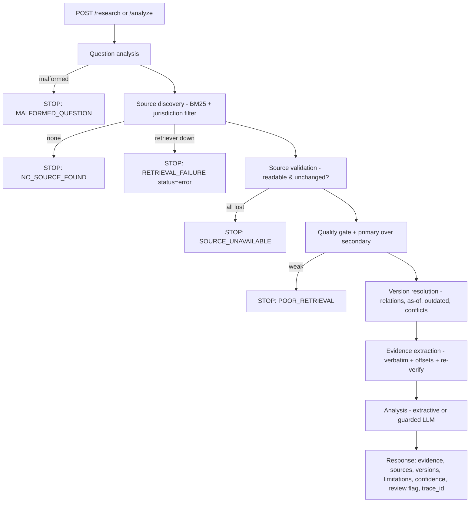

# Architecture

```mermaid
flowchart TD
  A[POST /research or /analyze] --> B[Question analysis]
  B -->|malformed| X[STOP: MALFORMED_QUESTION]
  B --> C[Source discovery - BM25 + jurisdiction filter]
  C -->|none| Y[STOP: NO_SOURCE_FOUND]
  C -->|retriever down| Z[STOP: RETRIEVAL_FAILURE status=error]
  C --> D[Source validation - readable & unchanged?]
  D -->|all lost| W[STOP: SOURCE_UNAVAILABLE]
  D --> E[Quality gate + primary over secondary]
  E -->|weak| V[STOP: POOR_RETRIEVAL]
  E --> F[Version resolution - relations, as-of, outdated, conflicts]
  F --> G[Evidence extraction - verbatim + offsets + re-verify]
  G --> H[Analysis - extractive or guarded LLM]
  H --> I[Response: evidence, sources, versions, limitations, confidence, review flag, trace_id]
```
